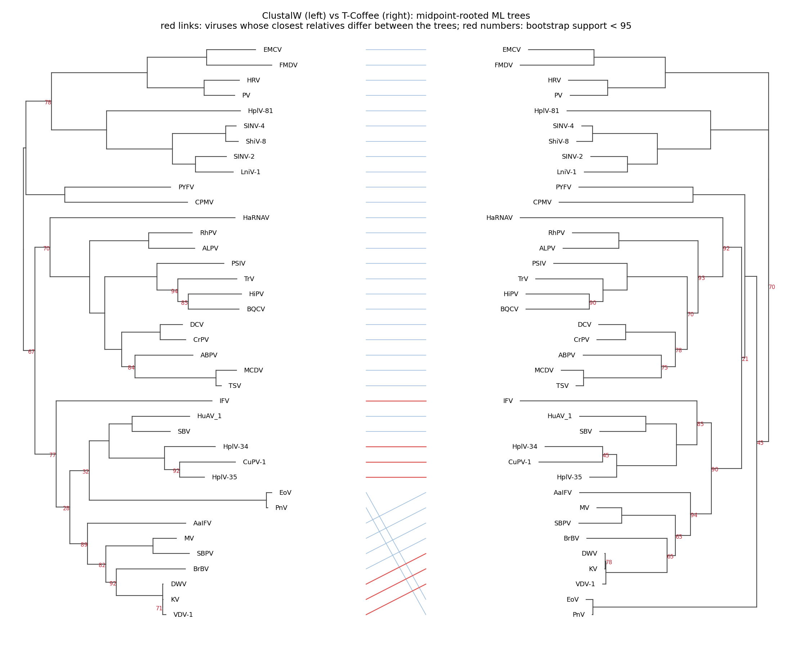
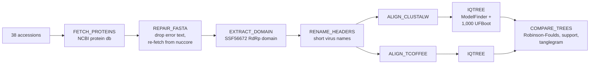

# PhyloBot: does the alignment tool change the evolutionary tree?

[](https://github.com/Abdelrahman-521/rdrp-phylogenetics-pipeline/actions/workflows/ci.yml)

A **Nextflow** pipeline that rebuilds the family tree of 38 RNA viruses from one shared gene: **RdRp**, the RNA-dependent RNA polymerase every RNA virus uses to copy itself. It aligns the same sequences with two tools, **ClustalW** and **T-Coffee**, builds a maximum-likelihood tree from each with **IQ-TREE**, and measures how much the choice of aligner changes the answer.

## What it found

Same 38 viral RdRp domains, two aligners, two maximum-likelihood trees:

- **The trees mostly agree.** They share 29 of 35 clades (Robinson-Foulds distance 12 out of a possible 70).
- **Where they disagree, the support is weak.** Clades both trees contain average 95 (ClustalW) and 93 (T-Coffee) bootstrap support. Clades only one tree has average about 61. The aligner moves the shaky branches, not the solid ones.
- **The paper's own virus moves.** CuPV-1, the mosquito virus the original 2018 paper was about, pairs with HplV-35 in the ClustalW tree (support 92) but with HplV-34 in the T-Coffee tree (support 45). In total, 7 of the 38 viruses get a different closest relative.
- **T-Coffee's alignment is longer and gappier:** 697 columns and 28% gaps, against 634 columns and 21% gaps.

*Run shown: `nextflow run . -profile local,test` on Ubuntu with ClustalW 2.1, T-Coffee 13.41 and IQ-TREE 2.0.7. That's the same 38 domains as the course run, with ModelFinder limited to LG, WAG and JTT (it picked LG+F+R5 for both alignments) and 1,000 ultrafast bootstraps. The full ModelFinder run is part of CI.*



Full report: [`results/comparison/comparison.md`](results/comparison/comparison.md)

## The pipeline



- **Resilient downloads.** NCBI calls back off and retry, and Nextflow retries the step up to three times. Three of the paper's accessions are nucleotide records, so the repair step fetches their translated CDS from `nuccore`, then fails loudly if anything is still missing instead of quietly building a tree from fewer viruses.
- **Parallel by design.** The two aligners, and then the two IQ-TREE runs, run side by side.
- **Reproducible.** A fixed IQ-TREE seed, the tool versions in `environment.yml`, and a Nextflow timeline, trace and run report written for every run (`results/pipeline_info/`).
- **Tested.** 19 unit tests for the Python steps, using fake NCBI responses. GitHub Actions also runs the whole pipeline twice on every push: an offline test from the bundled sequences, and a full run that downloads from NCBI.

## Run it

You need Java 17+, [Nextflow](https://www.nextflow.io/), ClustalW, T-Coffee, IQ-TREE 2 and Python with Biopython and matplotlib.

```bash
# tools from conda/bioconda (Nextflow builds the environment)
nextflow run . -profile conda

# or tools already on your PATH (e.g. on Ubuntu: apt install clustalw t-coffee iqtree)
nextflow run . -profile local

# offline smoke test from the bundled RdRp domains, a few minutes
nextflow run . -profile local,test

pytest tests        # unit tests for the Python steps
```

Useful options: `--bootstraps 1000`, `--seed 20241125`, `--iqtree_extra '-mset LG,WAG,JTT'`, `--regions my_interproscan.tsv --regions_format interproscan`, `--outdir results`.

## What's in here

| Path | What it is |
|---|---|
| `main.nf`, `modules/` | The Nextflow workflow: `prepare.nf` (download, repair, domain, names), `align.nf`, `trees.nf` |
| `bin/` | The Python steps Nextflow calls. Each is a small CLI you can also run by hand |
| `data/` | The 38 accessions, the RdRp domain coordinates from the team's InterProScan run, short virus names, and the domain sequences for offline runs |
| `results/` | Output of the run shown above: domains, both alignments, both trees with IQ-TREE reports, the comparison |
| `course_version/` | The original course scripts and results, unchanged |
| `docs/` | Project plan, proposal slides and the final presentation |

## History: course project, then the rebuild

**Fall 2024, COMP 3550 / BIOL 3951 (Bioinformatics), Memorial University.** A team of three: Abdelrahman Conber, Claire Gallant and Haley Leonard. The plan ([`docs/project_plan.pdf`](docs/project_plan.pdf)) was to re-run the alignment from a 2018 paper on CuPV-1, a picorna-like virus found in Culex mosquitoes, swapping ClustalW for T-Coffee and automating the steps with Nextflow.

- Our ClustalW tree didn't match the paper's. The paper didn't report enough detail to reproduce it: the MEGA version, the tree type, the alignment settings.
- So we switched approach: InterPro to find the RdRp domain, both aligners on that domain, and IQ-TREE for the trees ([final presentation](docs/project_presentation.pdf), [proposal slides](docs/proposal_presentation.pdf)).
- The steps were run by hand, script by script. Nextflow only got as far as a "Hello World" test, and "integrate the pipeline into Nextflow" was on our final slide as future work.

I wrote the course version's Python scripts: `checkerrors.py` (download repair), `get_superfamily.py`, `rename.py`, `trimseqs.py` and `cleanrdrp.py`. I also ran the InterPro filtering, the re-alignments and the IQ-TREE runs. Everything from the course is kept unchanged in [`course_version/`](course_version/).

**October 2026: the future work, done.** I turned it into a real Nextflow pipeline, building it with Claude Code as a pair programmer:

- my scripts became parameterised CLI steps, with checks that fail loudly
- the regions and virus names moved out of the code into data files
- the quantitative tree comparison is new (Robinson-Foulds distance, bootstrap support, closest-relative changes, tanglegram)
- unit tests and CI are new

## Tech
Nextflow (DSL2) · Python · Biopython · NCBI E-utilities · InterPro · ClustalW · T-Coffee · IQ-TREE 2 · matplotlib · pytest · GitHub Actions · conda
